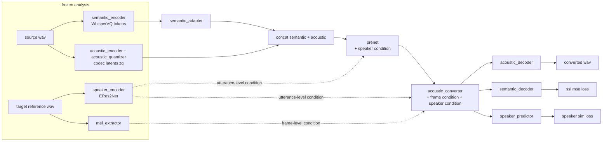

# Architecture

## X-VC data flow

X-VC converts a **source speaker's** speech to a **target speaker's** voice in
codec space. Two frozen analysis paths feed a trainable synthesis stack:

* **Semantic path** (what is said): `semantic_encoder` (frozen GLM-4-Voice
  WhisperVQ) → token embeddings → `semantic_adapter` upsampler.
* **Acoustic path** (how it sounds): `acoustic_encoder` + factorized VQ
  (`acoustic_quantizer`), both frozen — the codec latents `zq`.
* **Target conditioning** enters twice:
  * *utterance level*: a global speaker embedding from `speaker_encoder`
    modulates prenet and converter via AdaLN(-Zero) projections;
  * *frame level*: the target reference's mel (`mel_extractor`) is a second
    token stream inside `acoustic_converter`'s joint attention (the `_c`
    projections `to_q_c/to_k_c/to_v_c/to_out_c` and `ff_c`).
* `acoustic_converter` is a joint-attention transformer (DiT-style AdaLN-Zero
  gates; the final block does not update the conditioning stream).
* `acoustic_decoder` (vocoder) renders the waveform; `semantic_decoder` and
  `speaker_predictor` exist for training losses only.

Training objective (unchanged by the refactor): weighted sum of ssl-feature
MSE, VQ loss, multi-scale mel loss, speaker-similarity MSE, plus optional
adversarial/feature-matching losses once `generator_warmup_steps` is passed
(the fine-tunes set it above `total_step`, so the GAN path is off).

## Repository layout

| Area | Path | Notes |
|---|---|---|
| library package | `xvc/` | installable (`pip install -e .`), import-light |
| — adapters | `xvc/adapters/` | LoRA engine + injection/freezing/reporting API |
| — data | `xvc/data/` | versioned schemas + cross-pair validation engine |
| — training | `xvc/training/checkpointing.py` | checkpoint contract in one place |
| — utils | `xvc/utils/config.py` | recursive loader, composition, validation |
| model code | `models/codec/sac/` | XVC module tree (paths are load-bearing: saved configs reference `models.codec.sac.*` targets) |
| runtime | `bins/train.py`, `bins/infer_*.py` | unchanged training/inference runtime |
| entry points | `scripts/train.py`, `scripts/infer.py`, `scripts/validate_dataset.py`, `scripts/inspect_checkpoint.py` | the obvious way in |
| configs | `configs/` | legacy overlays + compositional groups (see `configs/LEGACY_MAPPING.md`) |
| experiment history | `CHANGES.md` | method log; `REFACTOR_PLAN.md` maps the code |

## Experiment families

| Family | Trainable set | Data presentation |
|---|---|---|
| Option A fine-tune | full `acoustic_converter` + `prenet` | self-reconstruction |
| Cross-pair latent | same (± `semantic_adapter`) | native→L2 pairs, DTW latent alignment |
| LoRA sweep | LoRA in `acoustic_converter` (± `prenet`) | cross-pairs |
| Distill / stack-distill | LoRA incl. AdaLN projections | teacher-rendered same-timeline pairs |
| AccentBridge | tiny residual editor, X-VC frozen | post-semantic-adapter stream |

Freezing is configured per model config (`no_grad` / `lora.enabled` /
`trainable_modules`) and enforced at startup by
`xvc.adapters.verify_trainable_modules` — a mismatch aborts before step 1.
